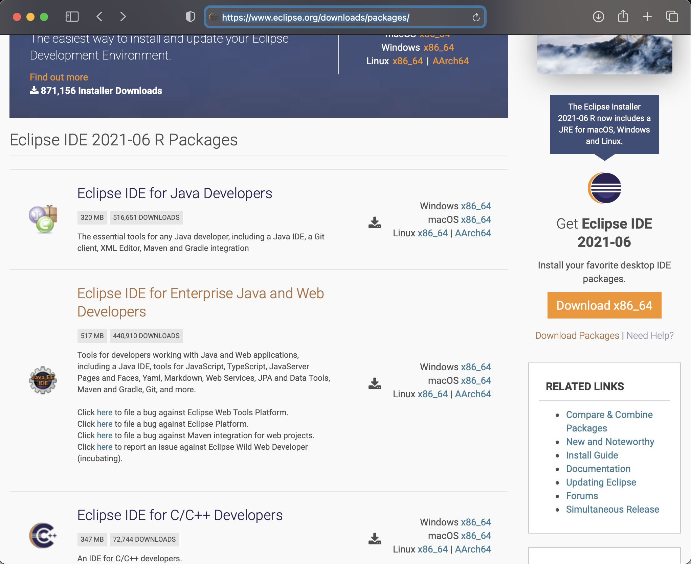
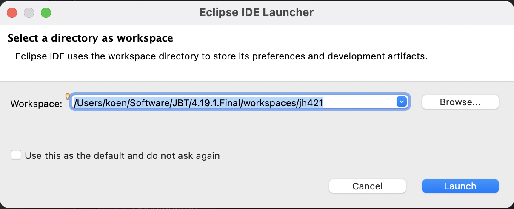
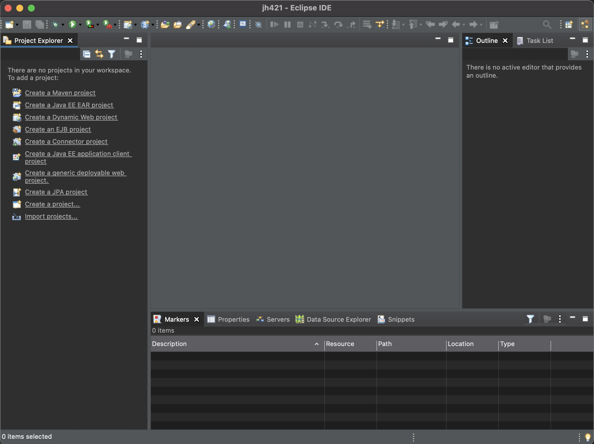

# Contribution guide

## Install JBoss Tools
Using our own dogfood, we use JBoss Tools as our development environment. JBoss Tools is a set of plugins for the Eclipse platform, so we'll start by obtaining that.

### Get the Eclipse Platform
Download the latest Eclipse platform for your OS from the Eclipse website. We will use the Eclipse IDE for Enterprise Java and Web Developers. You will find the most current download URL for this on the [Eclipse packages page](https://www.eclipse.org/downloads/packages/).

Install the downloaded artifact according to the instructions for your OS and launch Eclipse using the workspace of your choice.

After closing the welcome screen your Eclipse window should look more or less (depending on the OS on which you are working) like the screenshot below.

Now we are ready to add the JBoss Tools plugins.

