# Contribution guide

## Install JBoss Tools

Using our own dogfood, we use JBoss Tools as our development environment. JBoss Tools is a set of plugins for the Eclipse platform, so we'll start by obtaining that.

### Get the Eclipse Platform

Download the latest Eclipse platform for your OS from the Eclipse website. We will use the Eclipse IDE for Enterprise Java and Web Developers. You will find the most current download URL for this on the [Eclipse packages page](https://www.eclipse.org/downloads/packages/).


Install the downloaded artifact according to the instructions for your OS and launch Eclipse using the workspace of your choice.


After closing the welcome screen your Eclipse window should look more or less (depending on the OS on which you are working) like the screenshot below.


Now we are ready to add the JBoss Tools plugins.

### Add the JBoss Tools Plugins

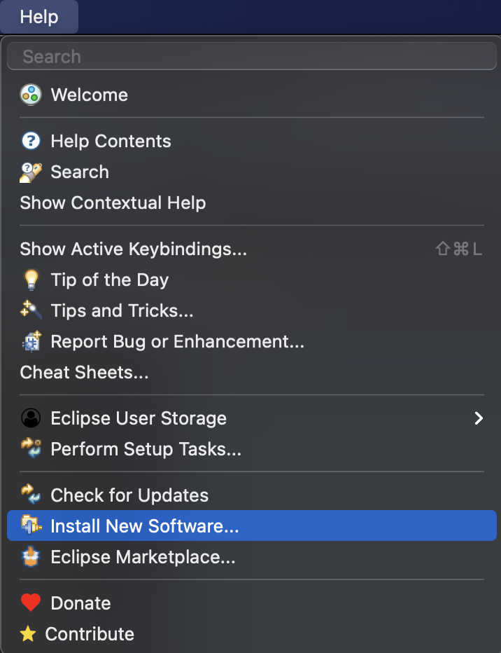

Start by selecting the 'Add New Software...' menu item from the 'Help' menu as shown above. In the 'Install' wizard that opens, use 'http://download.jboss.org/jbosstools/photon/stable/updates/' as the URL in the 'Work with' field and press 'Enter' for the JBoss Tools plugin categories to appear. Push the 'Select All' button to include all the JBoss Tools plugins.

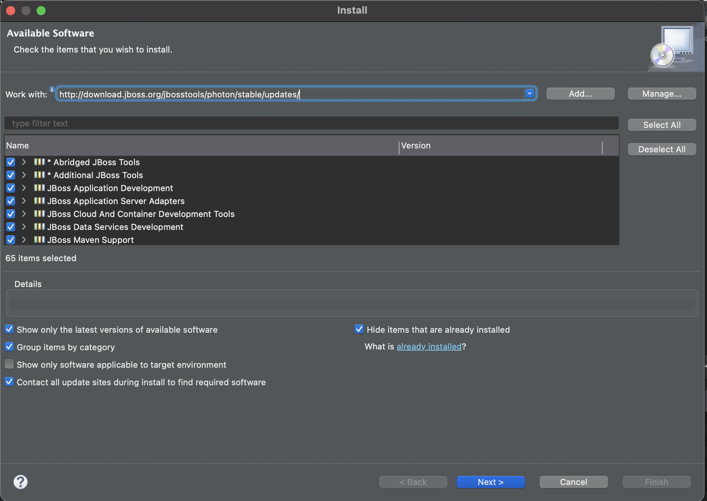

Press the 'Next >' button. The dependencies will be calculated and the details of what will be installed are shown on the second wizard page. 


You press the 'Next >' button one more time to arrive at the final wizard page where you can review the different licenses.


Choose to accept the licenses for the 'Finish' button to become enabled. Press this button to launch the installation. Be patient, the installation can take a while.
When a popup with a security warning appears informing you about the installation of unsigned software, choose 'Install anyway' to continue the installation.

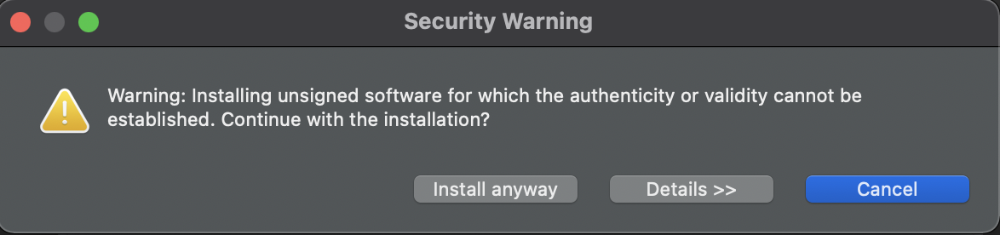

The next popup invites you to restart the Eclipse IDE to apply the newly installed plugins. Choose 'Restart Now' and wait for the Eclipse window to reopen.
The JBoss Tools plugins are now installed. However, to be able to develop tests for the Hibernate plugins, we also need to add the JBoss Tools test plugins.

### Add the JBoss Tools Test Plugins

The process to add the JBoss Tools test plugins is completely similar to the previous step. Again, you start by selecting 'Add New Software...' from the 'Help' menu. This time however, in the 'Install' wizard, you need to use 'https://download.jboss.org/jbosstools/photon/development/updates/coretests/' as the URL in the 'Work with' field.

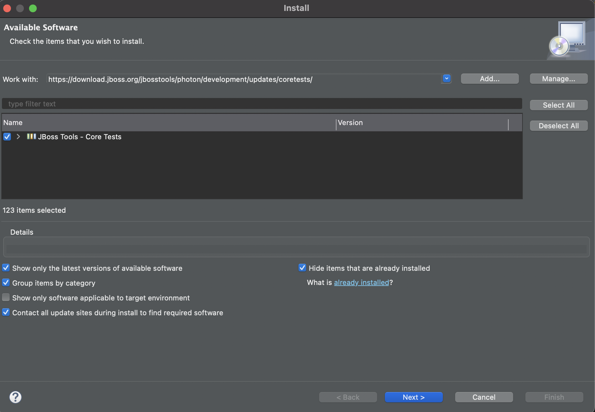

Press the 'Next >' button for the installation details to appear.

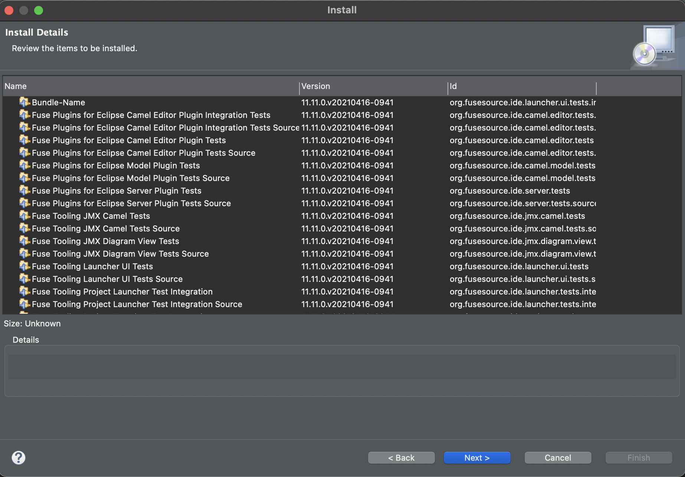

Press 'Next >' again to review and accept the licenses.

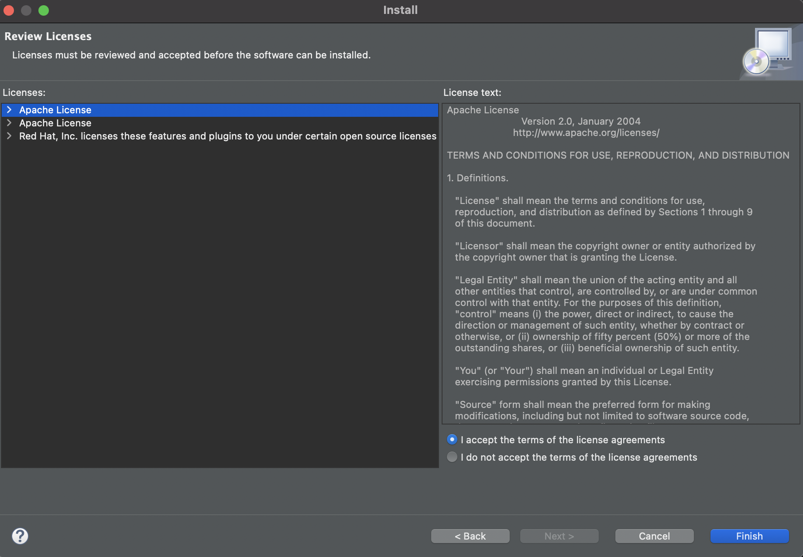

Press 'Finish' to launch the installation and 'Install anyway' in the security warning popup. After restarting, the JBoss Tools test plugins are installed as well and we are ready to import the JBoss Tools Hibernate code base.

## Prepare the JBoss Tools Hibernate Code Base

### Fork the JBoss Tools Hibernate GitHub Repository

Navigate to the [JBoss Tools Hibernate](https://github.com/jbosstools/jbosstools-hibernate) repository on GitHub and use the 'Fork' button in the topright corner of your screen to create a fork in your own github account.

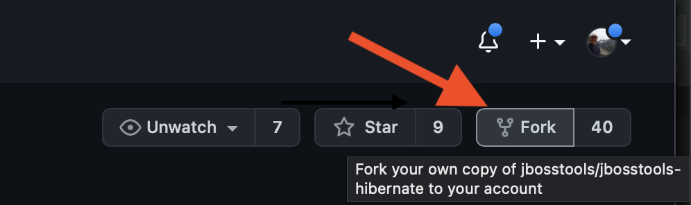
 
### Create a Local Clone

In a command-line window, navigate to the parent folder of where you want the JBoss Tools Hibernate code base to be cloned and issue the following command :

```
git clone https://github.com/jbosstools/jbosstools-hibernate
```

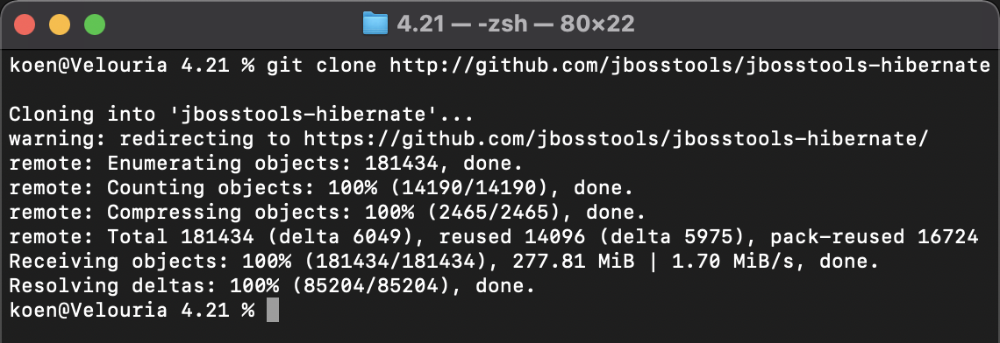

### Add Your Personal Repository as Remote

Use the command-line to navigate to your fresh local clone and issue the following command :

```
git remote add <remote-name> https://github.com/<your-github-account-name>/jbosstools-hibernate
```

Make sure to replace `<your-github-account-name>` by your GitHub account name and `<remote-name>` with a name of your choice (a good suggestion is to also use your GitHub account name). 

One more thing to do is to fetch the branches of your newly added personal remote repository by issuing the command :

```
git fetch <remote-name>
```
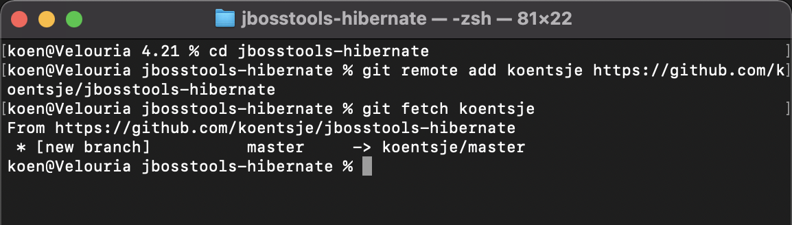

### Build the Project

We are using [Tycho](https://projects.eclipse.org/projects/technology) and [Maven](https://maven.apache.org) to build the project. Make sure that Maven is installed and that your Java version is at least 11. You can check your configuration by issuing `mvn version`.

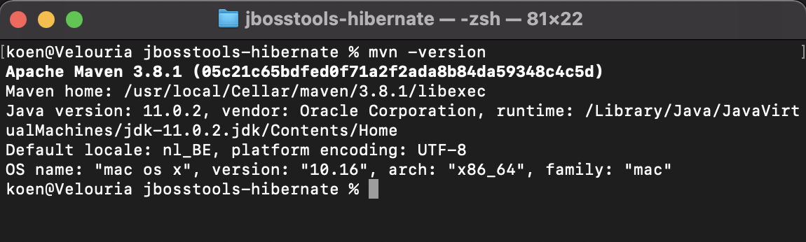

Building the project is as simple as issuing `mvn clean install` or `mvn clean verify`. This will include running all the tests of the project. Because this takes a while, you might want to skip this step. Do this by adding the 'skipTests' parameter: `mvn clean install -DskipTests=true`.


Now we are ready to import the project into our JBoss Tools installation.

## Import the JBoss Tools Hibernate Code Base

In the fresh JBoss Tools workbench that you installed earlier, open the Eclipse import wizard e.g. using the 'File > Import...' menu. On the 'Select' page of the wizard, select the 'Maven -> Existing Maven Projects' and afterwards push the 'Next >' button. 

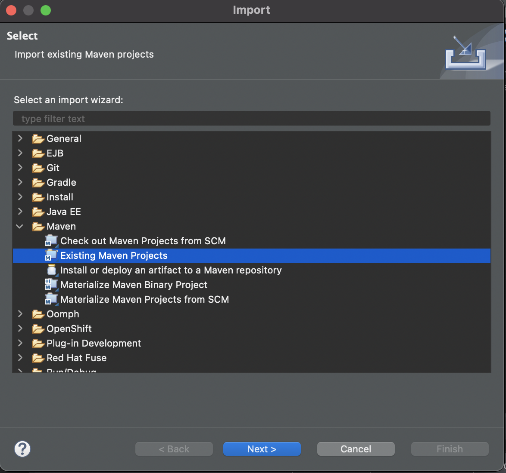

On the 'Maven Projects' page of the wizard, use the 'Browse...' button to navigate to the root folder of your local JBoss Tools Hibernate clone that you created previously.

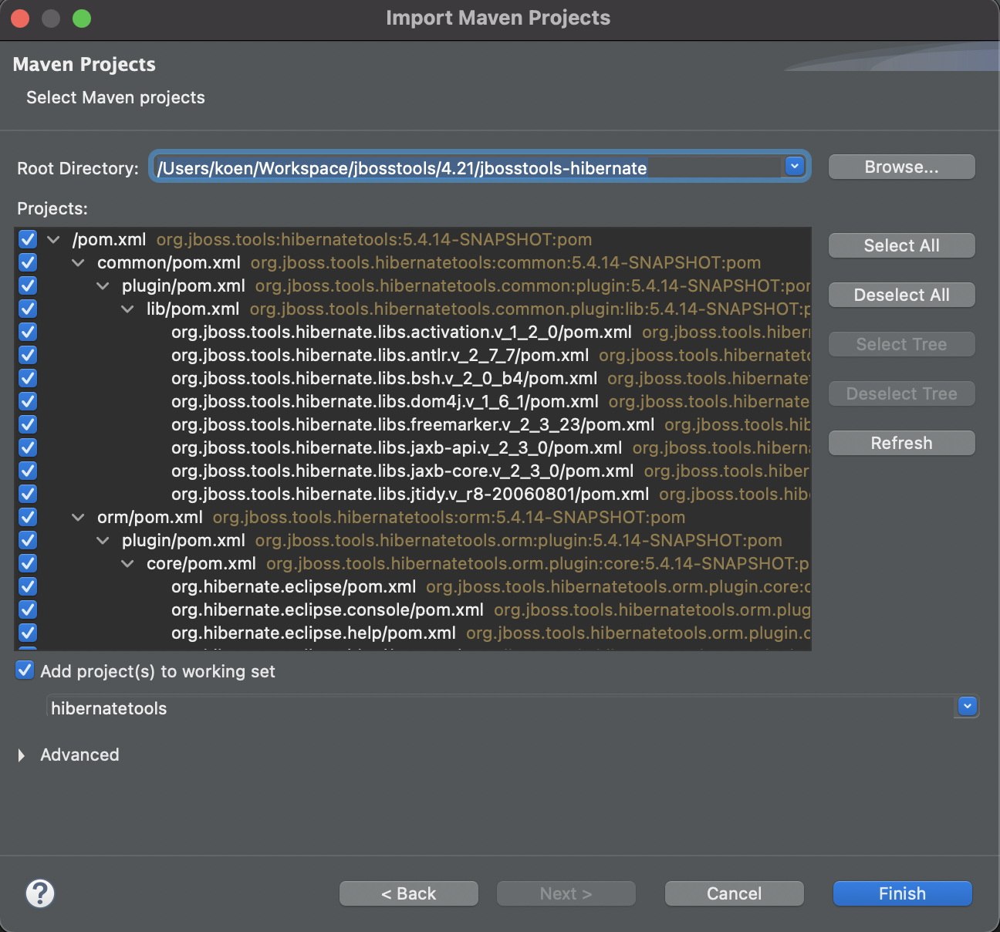

Just accept the defaults and make sure everything is selected. Push the 'Finish' button to start the import. At the end of the process a new popup window will appear inviting you to set up Maven plugin connectors that are lacking. 

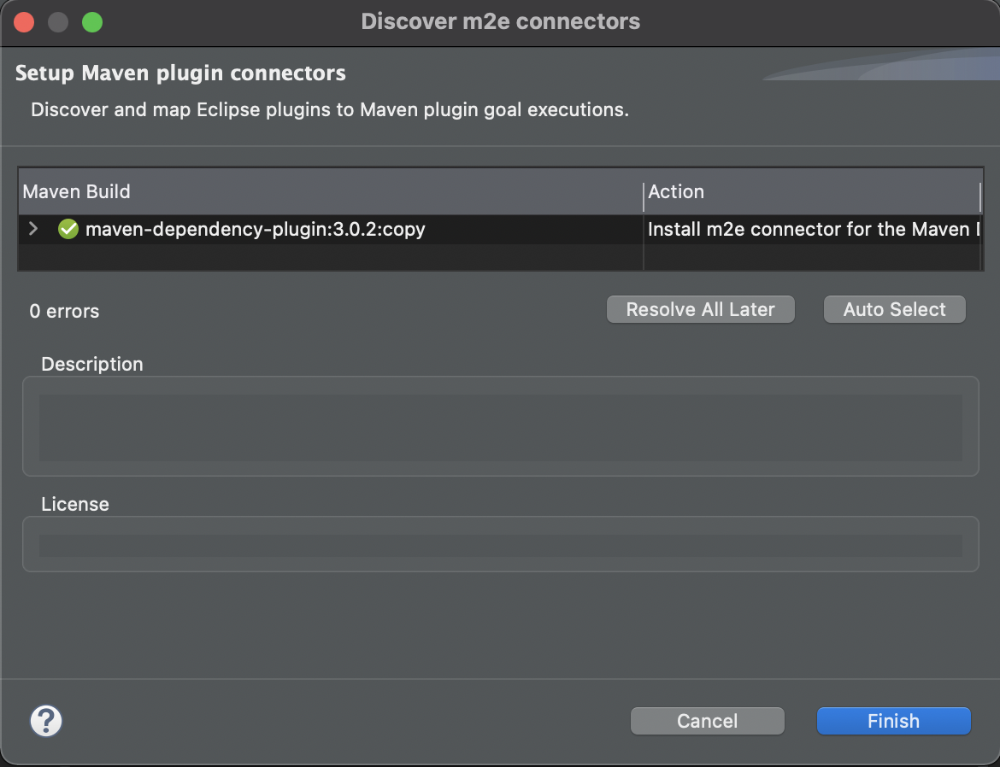

A m2e connector for the Maven Dependency plugin is not installed. Push the 'Finish' button to launch the discovery process for this plugin. After some time the 'Install' wizard appears.


Push the 'Next >' button to arrive at the 'Install Details' page of the wizard.

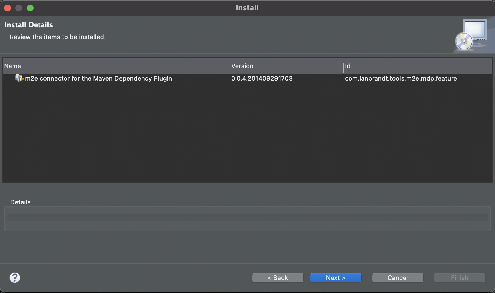

Push the 'Next >' button again to arrive at the 'Review Licenses' page of the wizard.

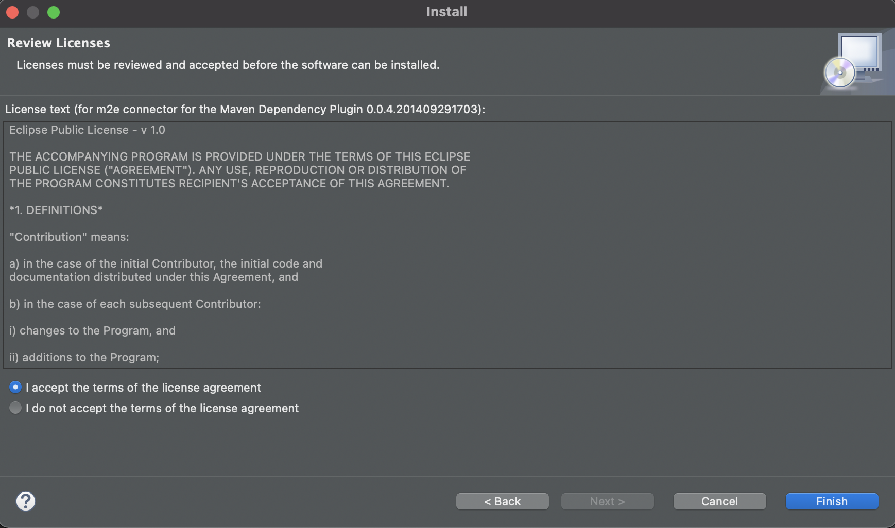

Accept the license and push the 'Finish' button to launch the installation of the plugin in the workbench. After a while, we get the security warning that we still know from the JBoss Tools installation earlier.


Push the 'Install anyway' button and when invited restart the workbench to apply the changes by pushing the 'Restart Now' button.

When the workbench reopens, you will need to wait some time for the Maven projects to be updated and rebuild. After that you will be ready to work on the source code. 

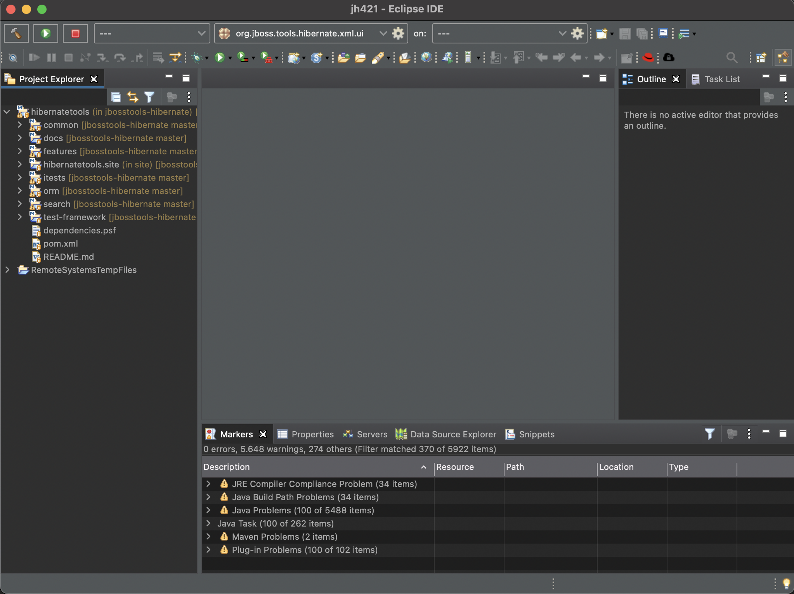

Congratulations! You have succesfully imported the JBoss Tools Hibernate code base. In the next section, we will talk more about how to contribute the changes you make.
